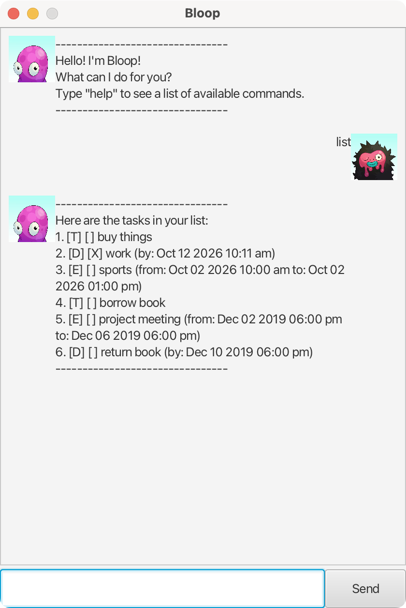

# Bloop User Guide

Bloop is a desktop task management chatbot that helps you keep track of your todos, deadlines, and events through a simple chat interface. It automatically saves your tasks so you never lose track of what's due.



## Quick start

1. Ensure you have Java 17 or above installed.
2. Download the latest `.jar` file from the releases page.
3. Run the application with `java -jar bloop.jar`.
4. Type commands in the text field and press **Send** (or hit Enter) to interact with Bloop.

## Commands

### Viewing help: `help`

Shows a list of all available commands.

```
help
```

### Listing all tasks: `list`

Displays all tasks currently in your list.

```
list
```

Expected output:

```
Here are the tasks in your list:
1. [T] [ ] read book
2. [D] [X] submit assignment (by: Dec 02 2019 06:00 PM)
3. [E] [ ] team meeting (from: Mar 15 2025 09:30 AM to: Mar 15 2025 11:00 AM)
```

### Adding a todo: `todo`

Adds a simple task with no date/time attached.

Format: `todo <description>`

```
todo read book
```

Expected output:

```
Got it. I've added this task:
  [T] [ ] read book
You now have 1 tasks in the list.
```

### Adding a deadline: `deadline`

Adds a task with a due date and time.

Format: `deadline <description> /by <d/M/yyyy HHmm>`

```
deadline submit assignment /by 2/12/2019 1800
```

Expected output:

```
Got it. I've added this task:
  [D] [ ] submit assignment (by: Dec 02 2019 06:00 PM)
You now have 2 tasks in the list.
```

### Adding an event: `event`

Adds a task with a start and end date/time.

Format: `event <description> /from <d/M/yyyy HHmm> /to <d/M/yyyy HHmm>`

```
event team meeting /from 15/3/2025 0930 /to 15/3/2025 1100
```

Expected output:

```
Got it. I've added this task:
  [E] [ ] team meeting (from: Mar 15 2025 09:30 AM to: Mar 15 2025 11:00 AM)
You now have 3 tasks in the list.
```

### Marking a task as done: `mark`

Marks a task at the given index as completed.

Format: `mark <index>`

```
mark 1
```

Expected output:

```
Nice! I have marked this task as done:
  [T] [X] read book
```

### Unmarking a task: `unmark`

Marks a task at the given index as not done.

Format: `unmark <index>`

```
unmark 1
```

Expected output:

```
Nice! I have marked this task as not done:
  [T] [ ] read book
```

### Deleting a task: `delete`

Removes a task at the given index from the list.

Format: `delete <index>`

```
delete 2
```

Expected output:

```
Noted. I've removed this task:
  [D] [X] submit assignment (by: Dec 02 2019 06:00 PM)
```

### Finding tasks: `find`

Searches for tasks whose description contains the given keyword.

Format: `find <keyword>`

```
find book
```

Expected output:

```
Here are the matching tasks in your list:
1. [T] [ ] read book
```

### Exiting the application: `bye`

Closes the application.

```
bye
```

## Date/time format

All dates and times follow the format `d/M/yyyy HHmm` (24-hour time, no colon).

| Input            | Interpreted as       |
| ---------------- | -------------------- |
| `2/12/2019 1800` | Dec 02 2019 06:00 PM |
| `15/3/2025 0930` | Mar 15 2025 09:30 AM |
| `1/1/2025 0000`  | Jan 01 2025 12:00 AM |

## Data storage

Tasks are saved automatically to `data/tasks.txt` after every change. They are reloaded when Bloop starts, so your tasks persist between sessions.
